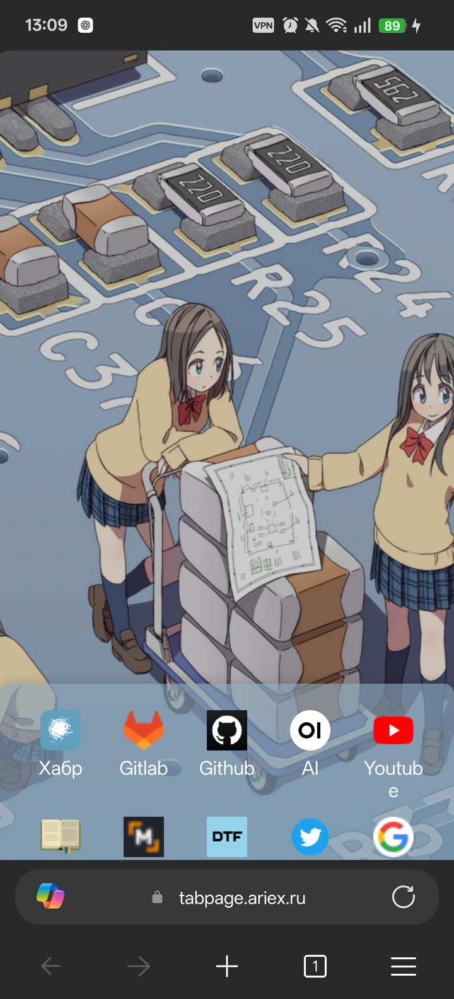
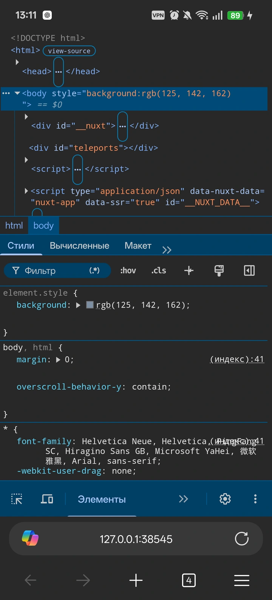
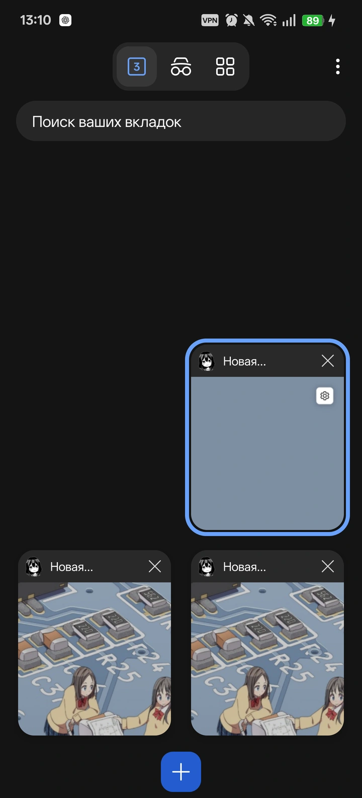
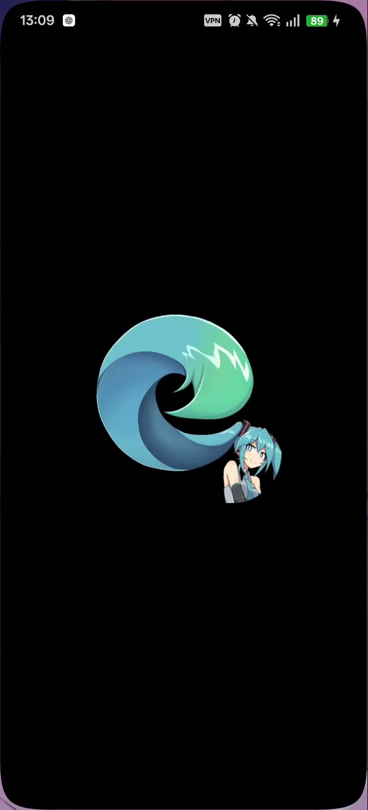

<p align="center">
  <a href="README.md">English</a> · <strong>Русский</strong>
</p>

<p align="center">
  
</p>

<h1 align="center">Edge ReVanced</h1>

<p align="center">
  <strong>Microsoft Edge Canary для Android, доведённый до уровня Kiwi Browser.</strong>
  <br>
  Расширения из Chrome Web Store, локальные DevTools, своя новая вкладка
  и интерфейс, до которого удобно дотянуться большим пальцем.
</p>

<p align="center">
  <a href="https://github.com/AriesAlex/edge-revanced/releases/latest/download/edge-revanced.apk">
    
  </a>
  <a href="https://github.com/AriesAlex/edge-revanced/releases">
    
  </a>
</p>

<p align="center">
  
  
  
  <a href="https://github.com/AriesAlex/edge-revanced/actions/workflows/release.yml">
    
  </a>
  <a href="LICENSE">
    
  </a>
</p>

> [!IMPORTANT]
> Готовая сборка предназначена для Android 10+ и `arm64-v8a`.
> Из-за другой подписи её нельзя обновить поверх официального Edge Canary:
> при первом переходе официальную Canary нужно удалить. Следующие версии
> Edge ReVanced устанавливаются поверх мода без потери данных.

## Что меняется

- **Расширения без whitelist.** На странице Chrome Web Store работает привычная
  синяя кнопка установки. Успешно установленное расширение сразу включается,
  без копирования ID в Developer options. Совместимость конкретного интерфейса
  с телефоном всё ещё зависит от автора расширения.
- **DevTools прямо на телефоне.** В меню Edge появляется пункт
  «Средства разработчика». Встроенный Chromium frontend подключается к текущей
  вкладке через локальный CDP-proxy; компьютер и удалённая отладка не нужны.
- **Любая новая вкладка.** В настройках новой вкладки остаётся только поле
  HTTP/HTTPS-адреса; MSN, новости, погода и обои убраны. По умолчанию открывается
  [`tabpage.ariex.ru`](https://tabpage.ariex.ru) с отдельными настройками для
  нескольких учётных записей, но адрес можно поменять прямо в Edge.
- **Вкладки под правую руку.** Первая карточка находится справа снизу, новые
  вкладки добавляются в обратном порядке вверх, а короткая сетка поднимается
  в удобную зону большого пальца. Длинный список прокручивается до края экрана
  без постоянной пустоты снизу.
- **Свайп вверх к вкладкам.** Экран вкладок открывается свайпом вверх по панели
  инструментов и при верхней, и при нижней адресной строке.
- **Свой брендинг.** Приложение называется `Edge ReVanced`, использует обычную
  иконку Edge вместо Canary и показывает Miku-арт в настоящем системном splash
  без искусственной задержки.
- **Без навязчивого account notice.** Закрывается только повторяющееся окно
  «Краткое примечание о вашей учетной записи Майкрософт» — аккаунт и
  синхронизация продолжают работать.

## Как это выглядит

<table>
  <tr>
    <td width="50%" align="center" valign="top">
      <h3>Своя новая вкладка</h3>
      <p>
        Вместо Microsoft NTP открывается полноценная персональная страница
        с синхронизацией, несколькими аккаунтами и крупными touch-целями.
      </p>
      
    </td>
    <td width="50%" align="center" valign="top">
      <h3>Мобильные DevTools</h3>
      <p>
        DOM, стили, консоль, Sources, Network и остальные Chromium-панели.
        Кнопка <code>»</code> для скрытых инструментов всегда остаётся на виду.
      </p>
      
    </td>
  </tr>
  <tr>
    <td width="50%" align="center" valign="top">
      <h3>Вкладки ближе к пальцу</h3>
      <p>
        Активная вкладка — справа, старые карточки — ниже, новые растут вверх.
        До основных действий не приходится тянуться через весь экран.
      </p>
      
    </td>
    <td width="50%" align="center" valign="top">
      <h3>Настоящий Android splash</h3>
      <p>
        Системная заставка Android заменена ресурсным патчем: без второго
        Activity, фальшивого экрана и задержки запуска браузера.
      </p>
      
    </td>
  </tr>
</table>

<p align="center">
  <sub>
    Реальные скриншоты Edge Canary 152.0.4184.0 на OnePlus 13,
    Android 16, портретный режим.
  </sub>
</p>

## Установка

1. Скачайте [`edge-revanced.apk`](https://github.com/AriesAlex/edge-revanced/releases/latest/download/edge-revanced.apk).
2. Если установлена официальная **Edge Canary**, удалите её один раз из-за
   несовпадающих подписей.
3. Откройте APK на телефоне и разрешите установку из выбранного источника.
4. Следующие релизы ставьте поверх текущего Edge ReVanced — профиль, вкладки и
   настройки сохранятся.

Через ADB тот же APK устанавливается так:

```powershell
adb install -r 'C:\path\to\edge-revanced.apk'
```

Стабильный URL выше всегда ведёт прямо на последний APK без ZIP-архива.
Версионный APK и соответствующий `.rvp` доступны на странице
[Releases](https://github.com/AriesAlex/edge-revanced/releases).

## Как устроен проект

```text
чистый монолитный Edge Canary APK (arm64-v8a)
                       │
                       ▼
              ReVanced Patcher 22
                       │
       ┌───────────────┼────────────────┐
       │               │                │
 Kotlin bytecode   mobile.rve      DevTools frontend
 resource patches  runtime Java    + touch-адаптация
       │               │                │
       └───────────────┼────────────────┘
                       ▼
            пересобранные DEX/resources
                       │
                       ▼
        подпись постоянным приватным ключом
                       │
                       ▼
                  готовый APK
```

- [`EdgePatches.kt`](patches/src/main/kotlin/app/revanced/patches/edge/EdgePatches.kt)
  содержит fingerprints и статические изменения DEX/resources.
- [`extensions/edge/mobile`](extensions/edge/mobile) собирается в `mobile.rve`.
  Runtime-код запускает DevTools proxy, обслуживает Chrome Web Store, закрывает
  точное account notice и настраивает Android View экрана вкладок.
- [`devtools-mobile.js`](scripts/devtools-mobile.js) адаптирует собранный
  Chromium DevTools frontend к узкому touch-интерфейсу.
- [`bootstrap.ps1`](scripts/bootstrap.ps1) проверяет ReVanced CLI по SHA-256,
  получает закреплённый commit официального Gradle plugin и собирает DevTools.
- [`patch.ps1`](scripts/patch.ps1) применяет `.rvp`, перепаковывает и подписывает
  APK, а [`verify-patched-apk.ps1`](scripts/verify-patched-apk.ps1) проверяет
  DEX-контракт новой вкладки, поток управления хуком Chrome Web Store, замену
  иконки Canary и достижимость оригинального продолжения анимации вкладок.
- [`edge-canary.ts`](scripts/edge-canary.ts) находит и скачивает последний
  монолитный ARM64 APK Canary для CI через открытый контракт MIT-проекта
  [EFF apkeep](https://github.com/EFForg/apkeep).

`.rvp` — JAR-контейнер с metadata, JVM-классами патчей, их Android DEX-версией,
runtime extension и ресурсами. Сам Edge и Microsoft-код внутрь `.rvp` не входят.

<details>
<summary><strong>Сборка из исходников</strong></summary>

### Требования

- Windows PowerShell;
- Git;
- JDK 21;
- Bun;
- Android SDK Platform `37.0` и Build-Tools `37.0.0`;
- чистый монолитный `arm64-v8a` APK Edge Canary, не split APK.

### Подготовка и сборка bundle

```powershell
.\scripts\bootstrap.ps1
.\scripts\build.ps1
```

Bootstrap создаёт воспроизводимые ignored-артефакты:

- ReVanced CLI `6.0.0` / Patcher `22.0.0`;
- официальный `revanced-patches-gradle-plugin` на закреплённом commit;
- Chromium DevTools frontend с русской и английской локалями.

Frontend упаковывается в детерминированный ZIP с manifest и SHA-256 исходников.
Повторный запуск проверяет готовый архив и становится no-op.

### Создание APK

```powershell
.\scripts\patch.ps1 `
    -Apk 'C:\path\to\Edge-Canary-arm64.apk'
```

Без `-Rvp` скрипт сначала собирает bundle из текущих исходников. Готовый bundle
можно применить без Gradle, Bun и повторной загрузки DevTools:

```powershell
.\scripts\patch.ps1 `
    -Apk 'C:\path\to\Edge-Canary-arm64.apk' `
    -Rvp 'C:\path\to\edge-revanced.rvp'
```

DevTools frontend уже находится внутри `.rvp`, но для перепаковки всё равно
нужны ReVanced CLI, Android SDK framework `37.0`, `aapt2`, исходный APK и
постоянный ключ подписи.

`-NewTabUrl` задаёт только начальный адрес для нового профиля:

```powershell
.\scripts\patch.ps1 `
    -Apk 'C:\path\to\Edge-Canary-arm64.apk' `
    -NewTabUrl 'https://example.com/start' `
    -CpuCount 6
```

После установки любой пользователь может поменять его без пересборки:
**Настройки → Страница новой вкладки → Адрес новой вкладки**. Остальные
настройки Microsoft NTP скрыты, а выбранный адрес начинает использоваться
следующей новой вкладкой.

Для отдельной тестовой установки доступен пакет
`com.microsoft.emmx.canary.revanced`:

```powershell
.\scripts\patch.ps1 `
    -Apk 'C:\path\to\Edge-Canary-arm64.apk' `
    -SideBySide
```

Side-by-side режим не является основным: Microsoft/Google login и внешние
интеграции могут проверять исходный package name.

Для локальной подписи передайте собственный ReVanced CLI keystore через
`-Keystore` или положите ignored-файл `edge-mod.keystore` в корень проекта.
Официальный ключ сборок не хранится в Git: GitHub Actions получает его только
из зашифрованного repository secret `EDGE_MOD_KEYSTORE_BASE64`. Не заменяйте
свой ключ между сборками — Android обновляет приложение только APK с той же
подписью.

</details>

<details>
<summary><strong>Что происходит при выходе новой версии Edge</strong></summary>

Патчи не привязаны к списку разрешённых версий. Точки внедрения ищутся по
структурным признакам: стабильным Chromium/Microsoft типам, сигнатурам, строкам,
resource references и характерным opcode-последовательностям.

1. Скачивается новый монолитный ARM64 APK Canary.
2. Тот же `.rvp` применяется без ручной правки номера версии.
3. Каждый fingerprint обязан найти ровно одну точку внедрения.
4. APK проходит статическую проверку и устанавливается через `adb install -r`.
5. Изменённые сценарии повторно проверяются на настоящем ARM64-устройстве.

Если Microsoft изменила затронутый code path, сборка останавливается на
конкретном fingerprint. Она не пытается молча пропатчить «похожий» метод.
Обфусцированные имена классов и методов не закрепляются в патчах, поэтому
обычная переминификация сама по себе не требует переписывать мод.

Успешная перепаковка APK не считается доказательством корректного UX:
финальная проверка выполняется на физическом телефоне.

</details>

<details>
<summary><strong>GitHub Actions, Releases и ReVanced Manager</strong></summary>

Workflow **Build Edge ReVanced APK** можно запустить вручную кнопкой
**Run workflow**. Он:

1. определяет последнюю версию Edge Canary;
2. скачивает монолитный `arm64-v8a` APK;
3. проверяет package name, ABI и подпись Microsoft;
4. собирает `.rvp`, применяет патчи и подписывает APK;
5. проверяет имя, иконку, splash-ресурсы, версию, подпись и DEX-контракт;
6. публикует APK и `.rvp` отдельными artifacts и Release assets.

Push в `main` запускает тяжёлую сборку только тогда, когда Release для найденной
версии Canary ещё не существует. Ручной запуск всегда пересобирает последнюю
версию и обновляет существующий Release.

GitHub Actions artifacts всегда скачиваются как ZIP. Для прямой установки
используйте стабильный `edge-revanced.apk` из Release.

ReVanced Manager использует тот же Patcher на Android, но текущий Edge ReVanced
официально поддерживает PC pipeline. DevTools добавляет сотни ресурсов и требует
полной перекомпиляции через framework Android SDK 37 и совместимый `aapt2`;
обычный Manager не получает этот контракт из репозитория.

</details>

## Проверенная совместимость

Патчи и пользовательские сценарии проверены на ARM64-сборках:

- Edge Canary `152.0.4180.0`;
- Edge Canary `152.0.4184.0`.

Последний полный device-тест: **OnePlus 13, Android 16**.

## Лицензия

Edge ReVanced распространяется по лицензии [GPLv3](LICENSE).
