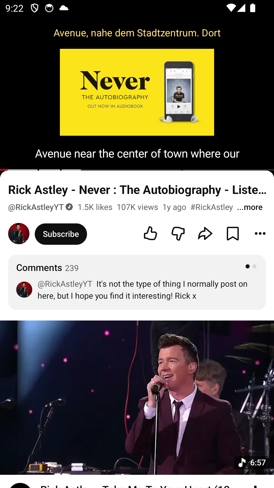
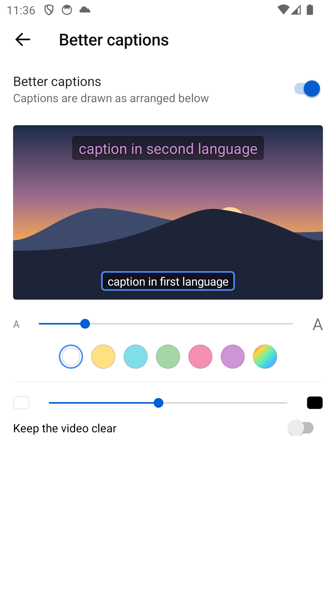
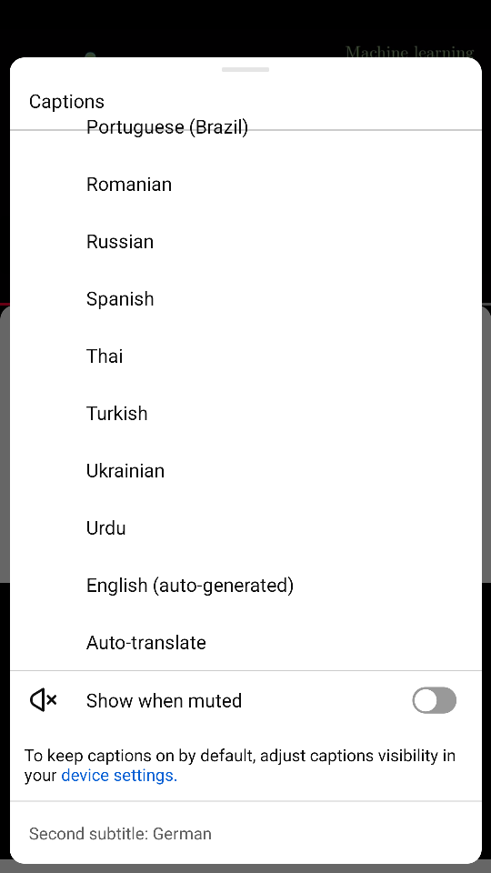
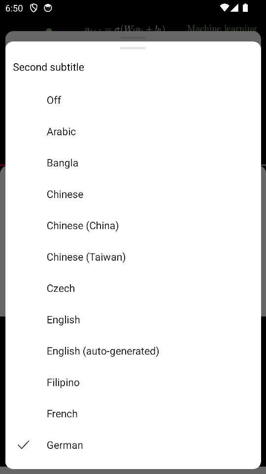

# gltieo patches

Add this URL in ReVanced Manager under Patches:

```
https://gitlab.com/gltieo/revanced-patches/-/raw/better-captions/manager.json
```

## Patches

### BetterCaptions

Change style of the captions and also add a second caption in a different language, e.g. for language learning.

<p align="center">
  
  
  
  
</p>
